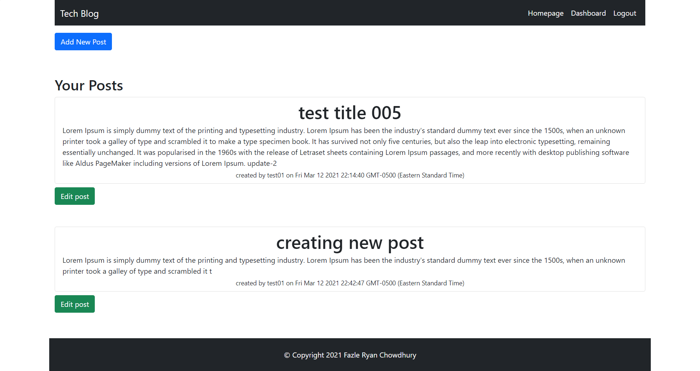

# tech-blog

## Screenshot:

## DESCRIPTION: 
AS A developer who writes about tech
I WANT a CMS-style blog site
SO THAT I can publish articles, blog posts, and my thoughts and opinions

## USAGE:
GIVEN a CMS-style blog site

WHEN user visit the site for the first time
THEN is presented with the homepage, which includes existing blog posts if any have been posted; navigation links for the homepage and the dashboard; and the option to log in

WHEN user clicks on the homepage option
THEN he/she is taken to the homepage

WHEN user click on any other links in the navigation
THEN is prompted to either sign up or sign in

WHEN user choose to sign up
THEN is prompted to create a username and password

WHEN user click on the sign-up button
THEN user credentials are saved and is logged into the site

WHEN user revisit the site at a later time and choose to sign in
THEN is prompted to enter his/her username and password

WHEN user is signed in to the site
THEN user can see navigation links for the homepage, the dashboard, and the option to log out

WHEN user click on the homepage option in the navigation
THEN is taken to the homepage and presented with existing blog posts that include the post title and the date created

WHEN user click on an existing blog post
THEN is presented with the post title, contents, post creator’s username, and date created for that post and have the option to leave a comment

WHEN user enters a comment and click on the submit button while signed in
THEN the comment is saved and the post is updated to display the comment, the comment creator’s username, and the date created

WHEN user click on the dashboard option in the navigation
THEN is taken to the dashboard and presented with any blog posts he/she has already created and the option to add a new blog post

WHEN user clicks on the button to add a new blog post
THEN is prompted to enter both a title and contents for the blog post

WHEN user click on the button to create a new blog post
THEN the title and contents of the post are saved and I is taken back to an updated dashboard with his/her new blog post

WHEN user click on one of his/her existing posts in the dashboard
THEN he/she is able to delete or update the post and is then taken back to an updated dashboard

WHEN user click on the logout option in the navigation
THEN is signed out of the site

WHEN user is idle on the page for more than 10 min
THEN he/she is automatically signed out of the site 

## TECHNICAL DESCRIPTION: 
- mysql2 package, express-handlebars, MySQL2, Sequelize, dotenv package, bcrypt package, express-session and connect-session-sequelize is used.
